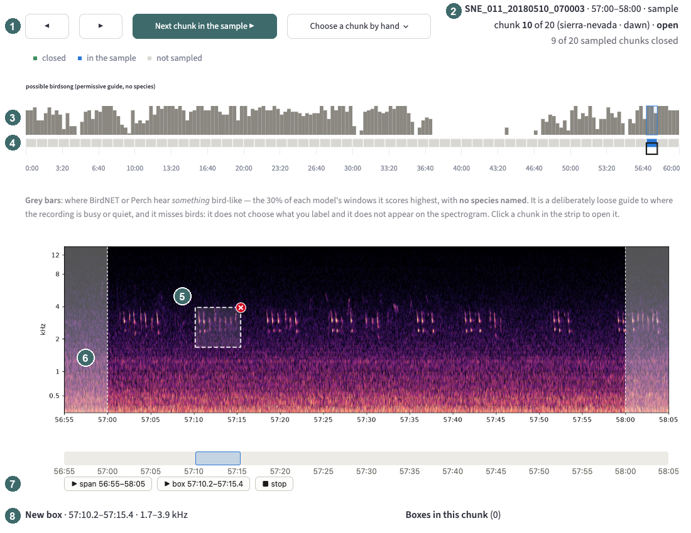
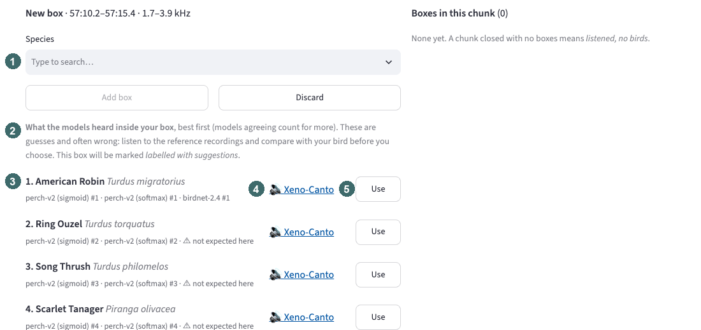
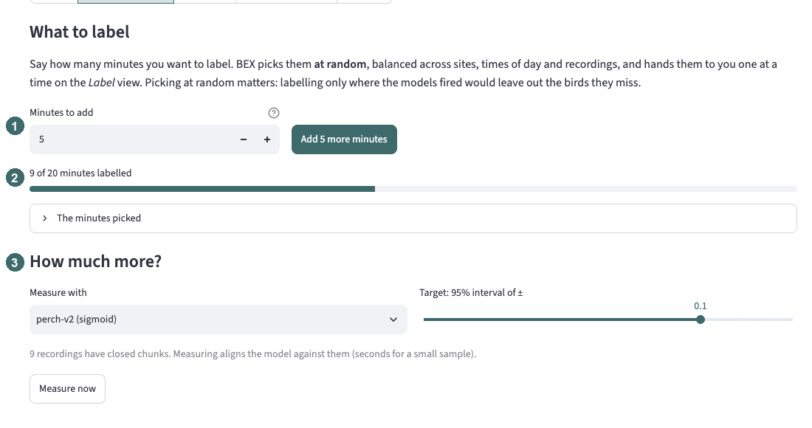
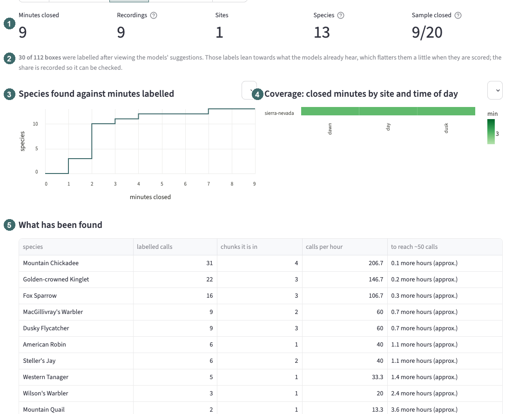
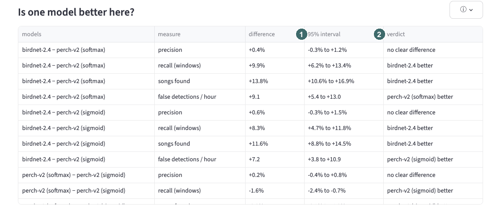
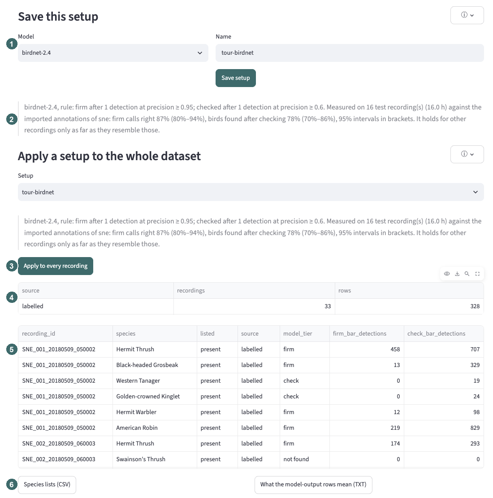

# A tour of BEX

A quick look at what BEX does, page by page. Every screenshot comes from the app
running on the Sierra Nevada soundscape set (33 hours of annotated recordings,
56 species) with three model runs: BirdNET 2.4, and Perch v2 read out two ways.
To try it on your own recordings, see the [README](README.md).

The idea: run your recordings through several models side by side, label a
random sample of them yourself, score every model against those labels, and
settle on a processing pipeline (model, thresholds, filter, survey rule) with a
known precision and recall — and error bars — that you can then run over the
rest of your recordings.

Any dataset can be looked at two ways, and you can switch between them at any
time: **labelled data, scored** (only what has been labelled, every number
judged against the labels) or **all recordings, unscored** (what the models
report everywhere, with no right or wrong).

---

## Home

1. **The flow**, numbered left to right: *1 · Label* to make ground truth,
   *2 · Explorer* to look and listen, *3 · Analysis* to compare the models, and
   *4 · Survey protocol* to decide how to turn detections into species lists.
2. **What you are looking at**: the current dataset and its view — *scored*
   (labelled data) or *unscored* (all recordings). Click it to switch.
3. **Each dataset's progress** through the same steps: *Add → Run models →
   Label → Explore → Analyse → Survey protocol → Apply*. A tick is done, a half
   circle under way; the outlined step is the next one. Hover a step for detail.
4. **Continue** goes to the next step. *Label* and *Explore all recordings* are
   always there: neither closes off the other.
5. **A dataset part-way through labelling**: here 3 of 5 sampled minutes done.
6. **Profile, spectrograms and models**: the dataset's plausibility profile,
   its spectrograms and its model runs, each with a progress bar and a button.
   For a new dataset these sit open in the card until they are done; a file the
   audio library cannot read is repaired here, before a model run trips over it.
7. **Add a dataset**: a folder of recordings, a site name, its location and a
   plausibility profile (BEX suggests one from the location).
8. **Upload a plausibility profile**: your own species list for a site, as a
   CSV of scientific or common names with an optional tier — the UK starter
   list downloads as a template.

---

## Label

Ground truth for your own recordings, a minute at a time. BEX picks the minutes
at random — balanced across sites, times of day and recordings — because
labelling only where the models fired would leave out the birds they miss.

1. **Moving around**: ◀ ▶ step to the previous or next minute of this
   recording; *Next chunk in the sample* goes to the next random minute.
   *Choose a chunk by hand* opens any minute (marked as chosen by hand).
2. **Where you are**: the recording, the minute, its place in the sample, and
   whether it is open or closed.
3. **A guide to where the recording is busy**: grey bars where BirdNET or Perch
   hear *something* bird-like. Deliberately loose, and it names no species.
4. **Every minute of the recording**, coloured by state — closed (green), in
   the sample (blue), not sampled. Click one to open it.
5. **A box drawn with two clicks**: one corner, then the opposite one. The red
   ✕ throws it away.
6. **The neighbouring minutes**, shaded either side. A call that crosses the
   minute can be boxed into them, or finished in the next minute (▶, then the
   second click).
7. **The player**, on the same time axis. *▶ box* plays just the box you have
   drawn (or the one selected in the box list), marked on the timeline.
8. **The new box**, waiting for its species.

1. **The species**: type to search the models' whole vocabulary. A bird you
   hear but cannot name is *Unknown bird*.
2. **💡 Suggest birds**, only after you have drawn a box: what the models heard
   inside it, best first, with models that agree counting for more.
3. **Each suggestion** with every model's rank for it, and ⚠ where the bird is
   not on the site's plausibility profile. Here American Robin — which is what
   the SNE annotators labelled this call.
4. **Reference recordings** on Xeno-Canto, to compare by ear.
5. **Use** fills in the species.

A box made after viewing suggestions is recorded as such: labels that lean on
the models flatter them a little when they are scored, so the share is kept
and shown. Close the minute once every bird you heard has a box — only closed
minutes count as ground truth, and a closed minute with no boxes means
*listened, no birds*.

1. **How many minutes**: 5 is a good start; add more whenever you like.
2. **How far you are** through the sample.
3. **How much more?** Once a few recordings have labels, BEX measures how much
   they vary and projects how many more you need for a given precision.

1. **What is labelled**: minutes, recordings, sites, species, and the sample.
2. **How many boxes were made with the models' suggestions.**
3. **Species found against minutes labelled**: when it flattens, more labelling
   has stopped turning up new birds.
4. **Coverage** by site and time of day — gaps here are gaps in what the
   scores can say.
5. **What has been found**, and roughly how much more labelling each species
   needs to reach about 50 calls (enough to fit a threshold for it).

*Publish and share* freezes a version of the labels to cite, exports them in
SNE's CSV columns, and imports CSV, Raven and Audacity annotations.

---

## Explorer

The Explorer is where you look at and listen to one recording at a time, with
every model's detections and the annotators' labels side by side.

1. **Looking at**: labelled data, scored, or all recordings, unscored.
2. **Scored against**: which labels — a dataset's imported annotations, or a
   label set you made (its working copy, or a published version).
3. **What every number rests on**: the dataset, and how much of it is labelled.
4. **Experiment settings**: models, plausibility profile and threshold rule.
   They apply to every page, and stay put as you move between pages.
5. **The view, on every page**, with a button to switch.
6. **The same, in the top bar**.
7. **Ground truth over the whole recording**: where the annotated birds are.
8. **One row per model.** Above the line, what the model reported: blue right,
   orange wrong, purple a real bird its location filter would hide. Below the
   line, the annotated birds it missed. Click anywhere to jump there.
9. **Step through** a window or a whole span at a time.

In the unscored view the same page shows what each model reported on every
recording, with no right or wrong; a recording only partly labelled is shown
that way too.

1. **The spectrogram, with the annotators' boxes**, coloured by species. Here a
   Hermit Thrush sings over an American Robin.
2. **The same annotations as a strip**, to line up with the lanes below.
3. **One score lane per model**, each on its own window grid (Perch 5 s, BirdNET
   3 s). Every bar is a detection above that species' threshold, in the species'
   colour.
4. **Height is confidence**: how far a detection clears its species' threshold,
   from just over it to the model's most certain. A wrong detection gets a ✕.
5. **An audio player on the same time axis**: play the span, or just the
   selected window.

In this minute BirdNET picks up both birds; both Perch readouts hear only the
thrush.

Click the spectrogram and the **window inspector** lists every model's scores
for that moment, each beside the species' own threshold, with what was
annotated there.

---

## Compare models

Which model is better overall, on equal terms. Every number on the page is at
one threshold rule, named in a banner at the top (here, "precision ≥ 0.95":
each species gets the threshold that keeps it at least 95% precise).

(The threshold rule and setting is key here - try lowering the precision floor in the sidebar to see the improved recall (the 'be correct' or 'be paranoid about missing things' tradeoff), or choose e.g. Max F1 for a statistical rule. Explore these more fully in the threshold tab, below)

1. **When it reports a bird**: how often it is right, and the false detections
   per hour you would actually see.
2. **When a bird is singing**: the share of annotated songs it finds. Counted
   per song, so a 3 s and a 5 s model compare fairly. Below it, one tick per
   species at the share of its songs found: a tight cluster is a consistent
   model, a spread one excellent on some birds and deaf to others.
3. **Every figure has an error bar**: the bracket is a 95% interval from
   resampling recordings — how far the number could move on another set of
   recordings like these.

**Is one model better here?** Each pair of models compared on the *same*
recordings, which is a much sharper test than whether their own intervals
overlap, because a hard recording is hard for both.

1. **The difference, with its 95% interval.**
2. **The verdict**: a model is *better* when the interval leaves out zero;
   otherwise *no clear difference* — more labelled recordings would narrow it.

The standard precision–recall picture. The lines use one threshold for every
species; the markers show where your per-species thresholds actually put each
model.

**What each model would tell you was in a recording**: the species list a
biodiversity survey would take from it. A model lists a species when it detects
it in the recording (once, or as many times as you choose). The green bar is how
many species are annotated in an average recording. Each model's bar stacks what
its list would make of them. Up to the dashed line are the species that are
there: named (blue), named only without the location filter (purple), or missed
(grey). Above it are species it would list that are not there (orange), or that
its filter removes (light grey).

Here every model names only about 6 of the 10 species in a recording. BirdNET's
short lists are nearly all right; Perch lists more, and much of the excess is
removed by the plausibility filter.

Or one recording at a time: the species annotated, and exactly what each model
would have told you was there.

Where the models differ, bird by bird.

---

## Species scorecard

The question a surveyor asks about one bird.

Every annotated species, with a dot per model at the share of its songs found.
Dot size is how many songs there are; the line's length is how much the choice
of model matters for that bird.

Pick a bird (here Mountain Chickadee) for a card per model: its threshold for
this bird, how often it is right, and how many songs it finds.

Which recordings each model does well and badly on. A bird a model handles
well overall can still vanish on one recorder or at one time of day. The page
goes on to show what each model confuses the bird with, and a button opens any
recording in the Explorer.

---

## Geofilter forensics

BirdNET can hide species it does not expect at your location. This page asks
what that filter actually does to each model's output. Shown here with the
judge set to BirdNET's own geofilter (Perch ships none).

1. **How much it hides**, out of everything the model detects.
2. **What it hid**, split into mistakes it removed (green) and correct
   detections it lost (purple).
3. **Precision without and with the filter**, and the change.
4. **Recall without and with**. Read the two together: a filter can lift
   precision while losing real birds.
5. **Annotated species it always hides**, whatever the audio says.

On these recordings BirdNET's filter barely moves precision (+0.1 points), while
costing 2.4 points of recall: of the 597 detections it hides, 542 were real,
annotated birds.

The birds the filter suppresses most. ⚠ marks a bird that was annotated in some
of those windows. Here Fox Sparrow, a common local bird that sits just under the
filter's cutoff, dominates.

---

## Survey protocol

The last step: how to turn a model's detections into a species list for each
recording. Detections are window by window; a survey wants to know which birds
were there. This page compares the rules that get from one to the other, with a
middle tier for an expert:

- **firm**: reported without review;
- **to check**: possibly there, so an expert listens before it is reported;
- **not found**.

1. **Your goal.** What to optimise for (here, the most birds found once the
   expert has checked the doubtful ones) and your limits: firm calls at least
   95% right, since nobody checks them, and at most 10 checks per recording.
2. **The rule.** Let BEX search for the best rule for your goal (for each model
   at its own best, side by side, or for one model), or set it by hand. A rule has a firm
   tier and a check tier, each with its own precision threshold and number of
   detections, so a strict bar can decide the firm calls while a looser one
   sends possible birds to the expert.
3. **The rules in force**, one per model, and where they came from.
4. **What each model's lists would hold**, each at its own rule, in an average
   recording. The green
   bar is the species annotated there. Below the dashed line, the species that
   are there: firm (blue), to check (pale blue), or not found (grey). Above it,
   the species listed that are not there.

Everything above is worked out on *tuning* recordings. Half the recordings are
held back as *test* recordings, because a rule chosen and scored on the same
recordings flatters itself.

Every rule the search tried, as birds found after checking against checks per
recording. The lines are each model's best for each amount of checking; the
large markers are each model's best for your goal, and the rings are the rules in
force.
For BirdNET, going from about 3 to 8 checks per recording lifts the birds found
from 69% to 83%.

**Run this rule** scores it on the test recordings.

1. **Each model at its own best rule.** (Optimise for one model instead, and a
   second tab compares every model on that one rule.)
2. **Birds found after checking**, per model. The black line is the 95% range
   across test recordings; the grey tick is the same number on the tuning
   recordings, so a rule fitted too closely to them shows up as a drop.
3. **Firm errors per recording**: the mistakes that would go into your results
   unchecked.

Here only Perch (sigmoid) keeps its firm calls above 95% right on recordings
the rule had not seen. **Full assessment** goes further: every recording takes a
turn as the test recording, for steadier numbers and a measure of how stable
the chosen rule is.

---

Once you have a rule you trust, **save it as a setup** and run it over every
recording — the point of labelling a sample in the first place.

1. **Which model** and a name.
2. **What the setup measured**: its rule, and how often its firm calls were
   right and how many birds it found after checking, on the held-out test
   recordings, with 95% intervals. This is the claim every list it produces
   carries.
3. **Apply to every recording.**
4. **Where each list comes from**: a recording labelled end to end keeps its
   labels (an expert's list beats a model's); everywhere else the list is the
   model's output, marked as such. (Every SNE recording is labelled, so all
   are *labelled* here; on your own data most will be *model output*.)
5. **The lists**, recording by recording, with the model's verdict beside each.
6. **Download** the lists, and the claim that says what the model-output rows
   can be trusted to mean. `bex survey` does the same from the command line.

---

## Thresholds

Every model's threshold for every species, and why it is what it is: the
precision–recall curve for each bird, with each model's operating point marked.
Override any threshold by hand, and save the lot as a named set that you can
apply to recordings that have no annotations.

---

**Try it:** `pip install bex-bioacoustics`, then follow the
[README](README.md). Feedback and bug reports are welcome as
[GitHub issues](https://github.com/donora/bex/issues).
