# A tour of BEX

A quick look at what BEX does, page by page. Every screenshot comes from the app
running on the Sierra Nevada soundscape set (33 hours of annotated recordings,
56 species) with three model runs: BirdNET 2.4, and Perch v2 read out two ways.
To try it on your own recordings, see the [README](README.md).

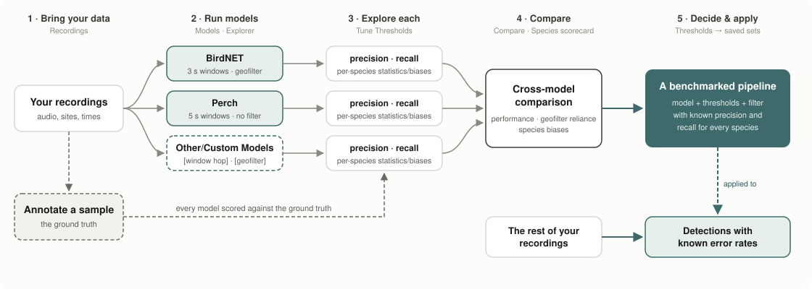

The idea: run your recordings through several models side by side, score each
against the same ground truth, and settle on a processing pipeline (model,
thresholds, filter) with a known precision and recall for every species.

---

## Home

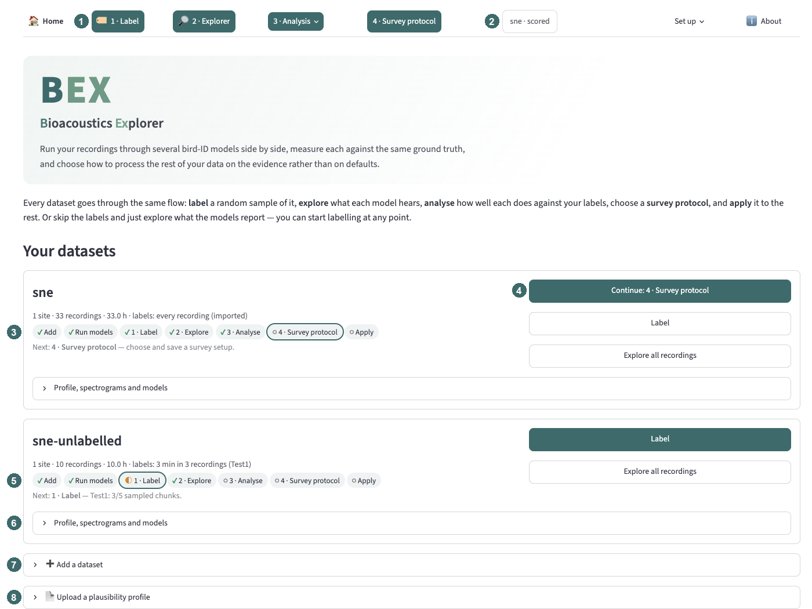

What is loaded (recordings, model runs, saved threshold sets) and where to go
next. The bar across the top follows the workflow, numbered left to right:
**1 · Explorer** to look and listen, **2 · Analysis** to compare the models, and
**3 · Survey protocol** to decide how to turn detections into species lists. *Set
up* and *About* sit to the right.

---

## Explorer

The Explorer is where you look at and listen to one recording at a time, with
every model's detections and the annotators' labels side by side.

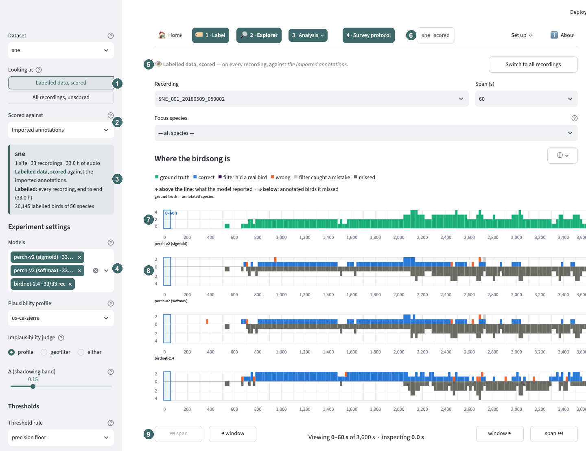

1. **Experiment settings.** Dataset, models, plausibility profile and threshold
   rule. They apply to every page, and stay put as you move between pages.
2. **Recording, span and focus species.** Pick a recording, how much of it to
   see at once, and optionally one bird to follow.
3. **Ground truth over the whole recording.** Where the annotated birds are.
4. **One row per model.** Above the line, what the model reported: blue right,
   orange wrong, purple a real bird its location filter would hide. Below the
   line, the annotated birds it missed.
5. **Where you are.** Click anywhere in the navigator to jump there.
6. **Step through** a window or a whole span at a time.

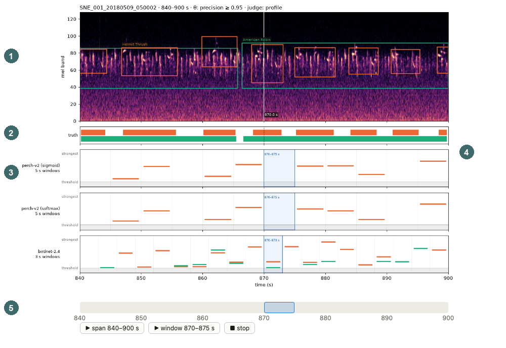

1. **The spectrogram, with the annotators' boxes**, coloured by species. Here a
   Hermit Thrush sings over an American Robin.
2. **The same annotations as a strip**, to line up with the lanes below.
3. **One score lane per model**, each on its own window grid (Perch 5 s, BirdNET
   3 s). Every bar is a detection above that species' threshold, in the species'
   colour.
4. **Height is confidence**: how far a detection clears its species' threshold,
   from just over it to the model's most certain. A wrong detection gets a ✕.
5. **An audio player on the same time axis**: play the span, or just the
   selected window.

In this minute BirdNET picks up both birds; both Perch readouts hear only the
thrush.

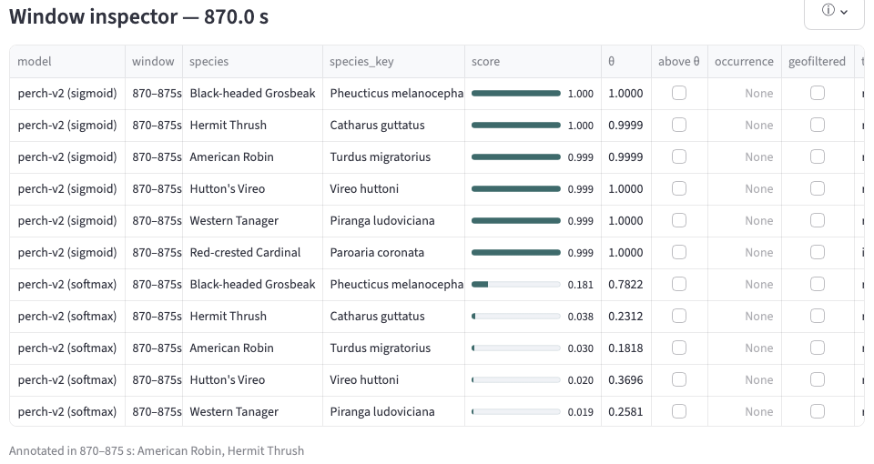

Click the spectrogram and the **window inspector** lists every model's scores
for that moment, each beside the species' own threshold, with what was
annotated there.

---

## Compare models

Which model is better overall, on equal terms. Every number on the page is at
one threshold rule, named in a banner at the top (here, "precision ≥ 0.95":
each species gets the threshold that keeps it at least 95% precise).

(The threshold rule and setting is key here - try lowering the precision floor in the sidebar to see the improved recall (the 'be correct' or 'be paranoid about missing things' tradeoff), or choose e.g. Max F1 for a statistical rule. Explore these more fully in the threshold tab, below)

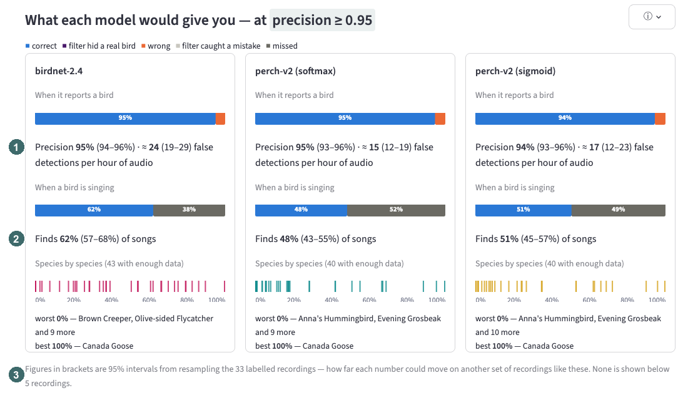

1. **When it reports a bird**: how often it is right.
2. **False detections per hour** you would actually see.
3. **When a bird is singing**: the share of annotated songs it finds. Counted
   per song, so a 3 s and a 5 s model compare fairly.
4. **Species by species**: one tick per species at the share of its songs found.
   A tight cluster is a consistent model; a spread one is excellent on some
   birds and deaf to others.

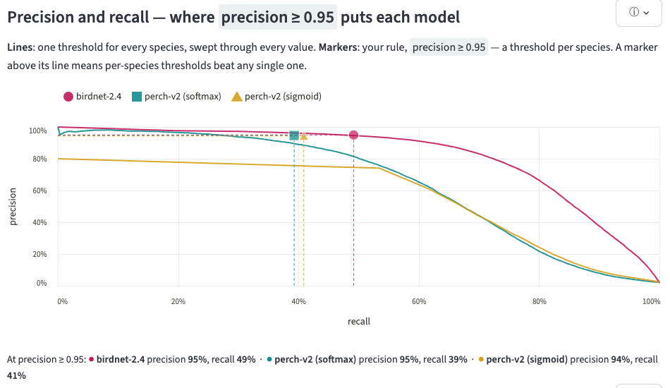

The standard precision–recall picture. The lines use one threshold for every
species; the markers show where your per-species thresholds actually put each
model.

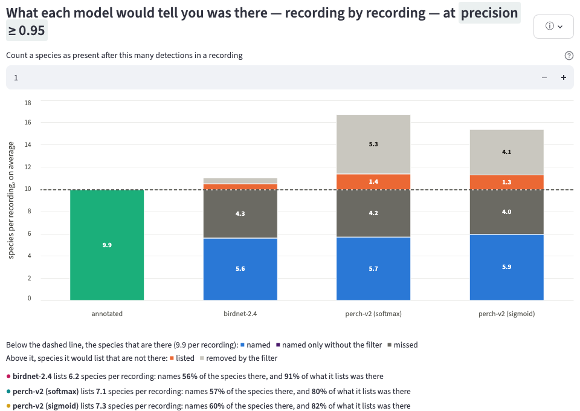

**What each model would tell you was in a recording**: the species list a
biodiversity survey would take from it. A model lists a species when it detects
it in the recording (once, or as many times as you choose). The green bar is how
many species are annotated in an average recording. Each model's bar stacks what
its list would make of them. Up to the dashed line are the species that are
there: named (blue), named only without the location filter (purple), or missed
(grey). Above it are species it would list that are not there (orange), or that
its filter removes (light grey).

Here every model names only about 6 of the 10 species in a recording. BirdNET's
short lists are nearly all right; Perch lists more, and much of the excess is
removed by the plausibility filter.

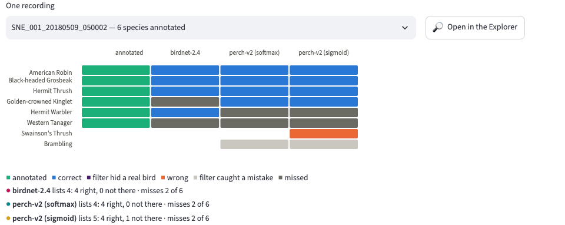

Or one recording at a time: the species annotated, and exactly what each model
would have told you was there.

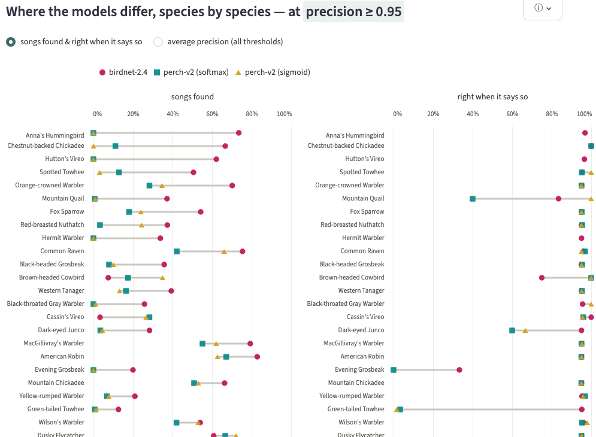

Where the models differ, bird by bird.

---

## Species scorecard

The question a surveyor asks about one bird.

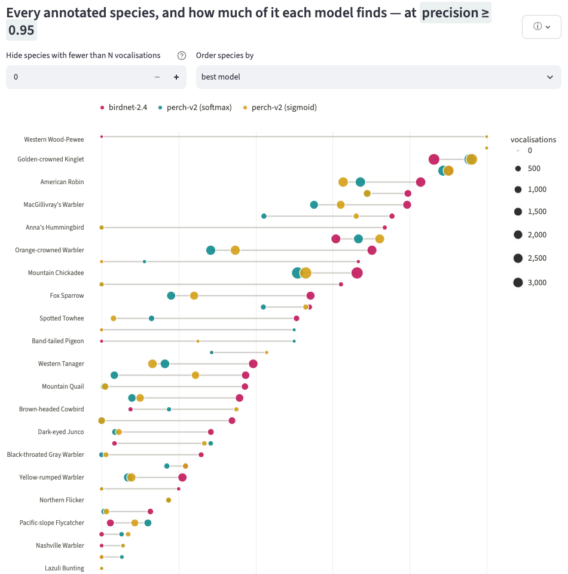

Every annotated species, with a dot per model at the share of its songs found.
Dot size is how many songs there are; the line's length is how much the choice
of model matters for that bird.

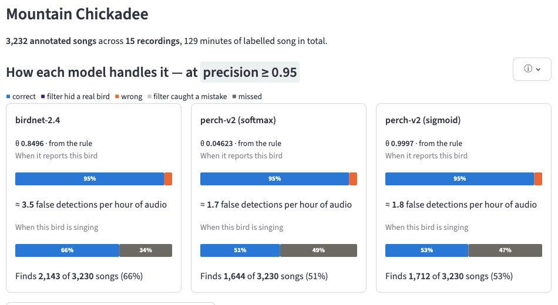

Pick a bird (here Mountain Chickadee) for a card per model: its threshold for
this bird, how often it is right, and how many songs it finds.

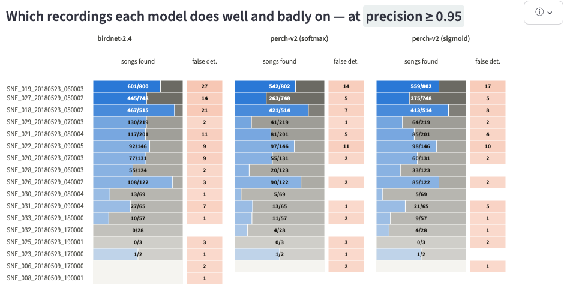

Which recordings each model does well and badly on. A bird a model handles
well overall can still vanish on one recorder or at one time of day. The page
goes on to show what each model confuses the bird with, and a button opens any
recording in the Explorer.

---

## Geofilter forensics

BirdNET can hide species it does not expect at your location. This page asks
what that filter actually does to each model's output. Shown here with the
judge set to BirdNET's own geofilter (Perch ships none).

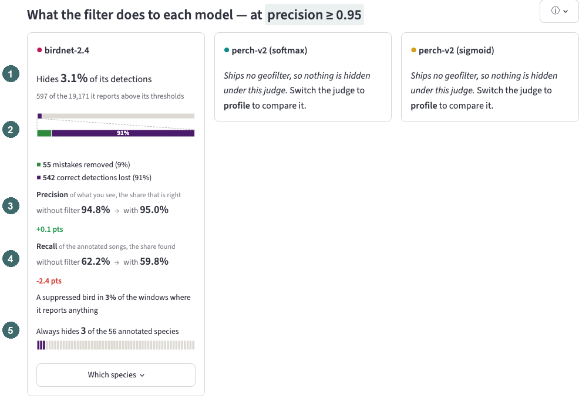

1. **How much it hides**, out of everything the model detects.
2. **What it hid**, split into mistakes it removed (green) and correct
   detections it lost (purple).
3. **Precision without and with the filter**, and the change.
4. **Recall without and with**. Read the two together: a filter can lift
   precision while losing real birds.
5. **Annotated species it always hides**, whatever the audio says.

On these recordings BirdNET's filter barely moves precision (+0.1 points), while
costing 2.4 points of recall: of the 597 detections it hides, 542 were real,
annotated birds.

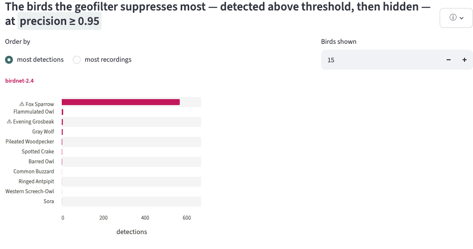

The birds the filter suppresses most. ⚠ marks a bird that was annotated in some
of those windows. Here Fox Sparrow, a common local bird that sits just under the
filter's cutoff, dominates.

---

## Survey protocol

The last step: how to turn a model's detections into a species list for each
recording. Detections are window by window; a survey wants to know which birds
were there. This page compares the rules that get from one to the other, with a
middle tier for an expert:

- **firm**: reported without review;
- **to check**: possibly there, so an expert listens before it is reported;
- **not found**.

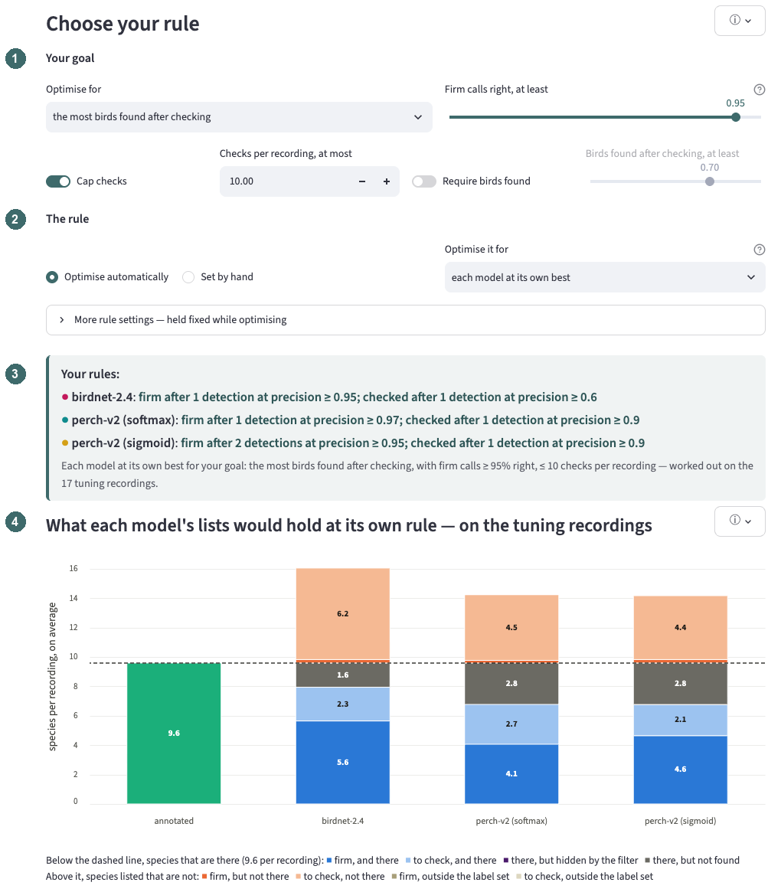

1. **Your goal.** What to optimise for (here, the most birds found once the
   expert has checked the doubtful ones) and your limits: firm calls at least
   95% right, since nobody checks them, and at most 10 checks per recording.
2. **The rule.** Let BEX search for the best rule for your goal (for each model
   at its own best, side by side, or for one model), or set it by hand. A rule has a firm
   tier and a check tier, each with its own precision threshold and number of
   detections, so a strict bar can decide the firm calls while a looser one
   sends possible birds to the expert.
3. **The rules in force**, one per model, and where they came from.
4. **What each model's lists would hold**, each at its own rule, in an average
   recording. The green
   bar is the species annotated there. Below the dashed line, the species that
   are there: firm (blue), to check (pale blue), or not found (grey). Above it,
   the species listed that are not there.

Everything above is worked out on *tuning* recordings. Half the recordings are
held back as *test* recordings, because a rule chosen and scored on the same
recordings flatters itself.

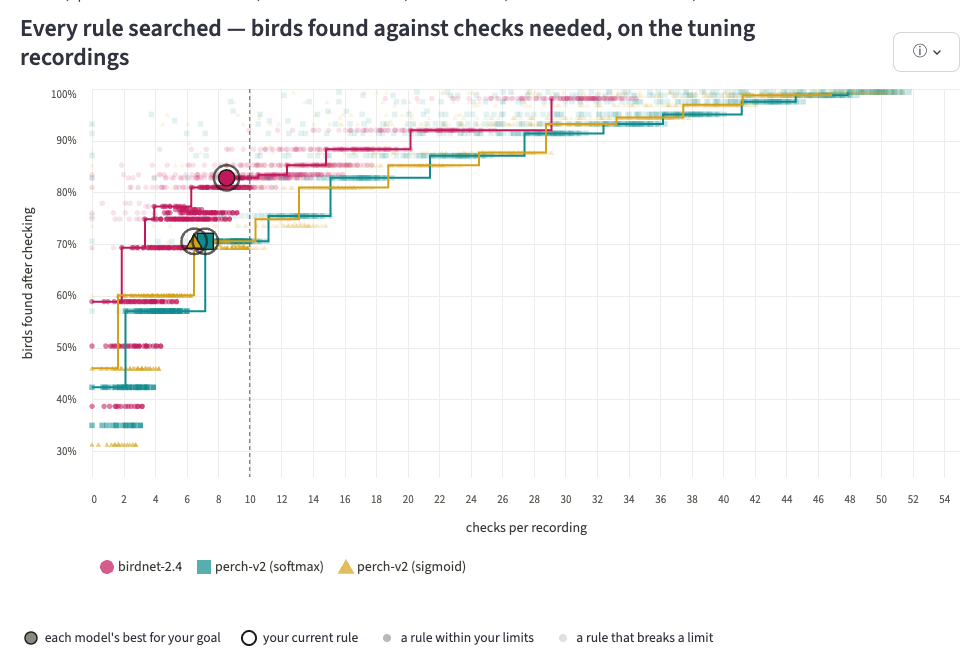

Every rule the search tried, as birds found after checking against checks per
recording. The lines are each model's best for each amount of checking; the
large markers are each model's best for your goal, and the rings are the rules in
force.
For BirdNET, going from about 3 to 8 checks per recording lifts the birds found
from 69% to 83%.

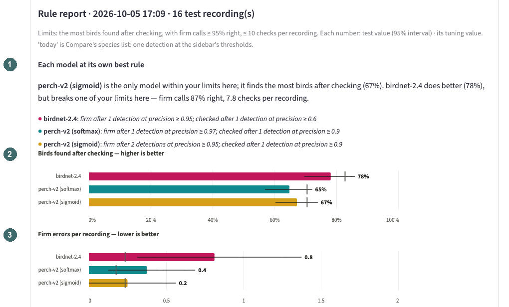

**Run this rule** scores it on the test recordings.

1. **Each model at its own best rule.** (Optimise for one model instead, and a
   second tab compares every model on that one rule.)
2. **Birds found after checking**, per model. The black line is the 95% range
   across test recordings; the grey tick is the same number on the tuning
   recordings, so a rule fitted too closely to them shows up as a drop.
3. **Firm errors per recording**: the mistakes that would go into your results
   unchecked.

Here only Perch (sigmoid) keeps its firm calls above 95% right on recordings
the rule had not seen. **Full assessment** goes further: every recording takes a
turn as the test recording, for steadier numbers and a measure of how stable
the chosen rule is.

---

## Thresholds

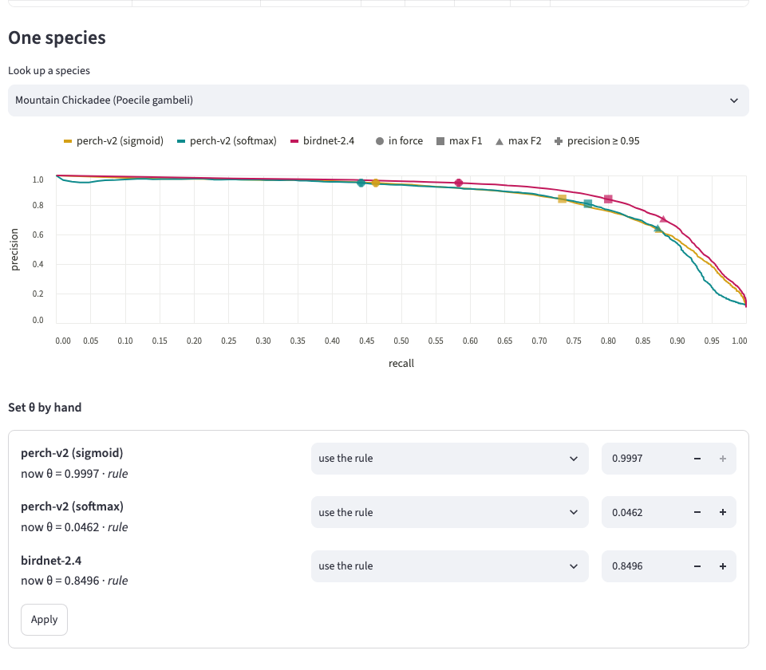

Every model's threshold for every species, and why it is what it is: the
precision–recall curve for each bird, with each model's operating point marked.
Override any threshold by hand, and save the lot as a named set that you can
apply to recordings that have no annotations.

---

**Try it:** `pip install bex-bioacoustics`, then follow the
[README](README.md). Feedback and bug reports are welcome as
[GitHub issues](https://github.com/donora/bex/issues).
